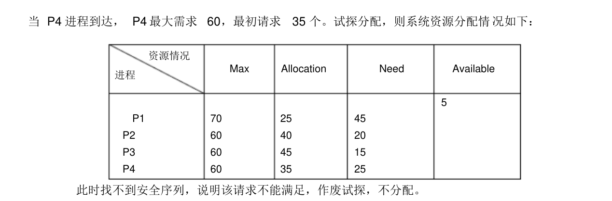

# 2-8

在道数不受限制的多道程序系统中，作业进入系统的后备队列时立即进行作业调度。现有4个作业进人系统，有关信息为

| 作业名 | 进入后备队列的时刻 | 执行时间/min | 优先数 |
| ------ | ------------------ | ------------ | ------ |
| Job1   | 8:00               | 60           | 1      |
| Job2   | 8:30               | 50           | 2      |
| Job3   | 8:40               | 30           | 4      |
| Job4   | 8:50               | 10           | 3      |

作业调度和进程调度均采用高优先算法（规定数值越大则优先越高）。试填充下表。

| 作业名 | 进入后备队列的时刻 | 执行时间/min | 开始执行时刻 | 结束执行时刻 | 周转时间/min | [带权周转时间](https://baike.baidu.com/item/%E5%B8%A6%E6%9D%83%E5%91%A8%E8%BD%AC%E6%97%B6%E9%97%B4/7145942?fr=aladdin)/min |
| ------ | ------------------ | ------------ | ------------ | ------------ | ------------ | ------------------------------------------------------------ |
|        |                    |              |              |              |              |                                                              |
|        |                    |              |              |              |              |                                                              |
|        |                    |              |              |              |              |                                                              |
|        |                    |              |              |              |              |                                                              |

| 平均周转时间T=     |
| ------------------ |
| 平均带权周转时间W= |

----------------------------------------------------------------

非抢占式,在同一时刻的作业，按优先数来，只要在执行就不能抢占

| 作业名 | 进入后备队列的时刻 | 执行时间/min | 开始执行时刻 | 结束执行时刻 | 周转时间/min | 带权周转时间/min |
| ------ | ------------------ | ------------ | ------------ | ------------ | ------------ | ---------------- |
| Job1   | 8:00               | 60           | 8:00         | 9:00         | 60           | 1                |
| Job2   | 8:30               | 50           | 9:40         | 10:30        | 120          | 2.4              |
| Job3   | 8:40               | 30           | 9:00         | 9:30         | 50           | 1.67             |
| Job4   | 8:50               | 10           | 9:30         | 9:40         | 50           | 5                |

| 平均周转时间T=(60+120+50+50)/4=70       |
| --------------------------------------- |
| 平均带权周转时间W=(1+2.4+1.67+5)/4=2.52 |

抢占式，在同一时刻的多个作业，按优先数来，谁多谁就可以抢占

| 作业名 | 进入后备队列的时刻 | 执行时间/min | 开始执行时刻 | 结束执行时刻 | 周转时间/min | 带权周转时间/min |
| ------ | ------------------ | ------------ | ------------ | ------------ | ------------ | ---------------- |
| Job1   | 8:00               | 60           | 8:00         | 10:30        | 150          | 2.5              |
| Job2   | 8:30               | 50           | 8:30         | 10:00        | 90           | 1.8              |
| Job3   | 8:40               | 30           | 8:40         | 9:10         | 30           | 1                |
| Job4   | 8:50               | 10           | 9:10         | 9:20         | 30           | 3                |

| 平均周转时间T=(150+90+30+30)/4=75       |
| --------------------------------------- |
| 平均带权周转时间W=(2.5+1.8+1+3)/4=2.075 |

# 2-21

有一个具有三道作业的多道批处理系统，作业调度采用短作业优先调度算法，进程调度采用以优先数为基础的抢占式调度算法。在下表所示的作业序列中，作业优先数即为进程优先数，优先数越小则优先级越高。

| 作业名 | 到达时刻 | 估计运行时间/min | 优先数 |
| ------ | -------- | ---------------- | ------ |
| A      | 10:00    | 40               | 5      |
| B      | 10:20    | 30               | 3      |
| C      | 10:30    | 60               | 4      |
| D      | 10:50    | 20               | 6      |
| E      | 11:00    | 20               | 4      |
| F      | 11:10    | 10               | 4      |

试填充下表：

| 作业 | 进入内存时刻 | 运行结束时刻 | 作业周转时间/min |
| ---- | ------------ | ------------ | ---------------- |
| A    |              |              |                  |
| B    |              |              |                  |
| C    |              |              |                  |
| D    |              |              |                  |
| E    |              |              |                  |
| F    |              |              |                  |

平均作业周转时间：

----------------------------------------------------------------------------------------------


| 作业 | 进入内存时刻 | 运行结束时刻 | 作业周转时间/min |
| ---- | ------------ | ------------ | ---------------- |
| A    | 10:00        | 12:40        | 160              |
| B    | 10:20        | 10:50        | 30               |
| C    | 10:30        | 11:50        | 80               |
| D    | 10:50        | 13:00        | 130              |
| E    | 12:00        | 12:20        | 80               |
| F    | 11:50        | 12:00        | 50               |

平均周转时间=(160+30+80+130+80+50)/6=88.3   

# 2-23

有5个作业依次进入系统，其提交时刻、运行时间、作业长度分别为

| 作业 | 提交时刻 | 运行时间 | 作业长度/KB | 开始执行时刻 | 完成时刻 | 作业周转时间/min |
| ---- | -------- | -------- | ----------- | ------------ | -------- | ---------------- |
| Job1 | 10:00    | 25       | 15          |              |          |                  |
| Job2 | 10:20    | 30       | 60          |              |          |                  |
| Job3 | 10:20    | 25       | 40          |              |          |                  |
| Job4 | 10:30    | 15       | 20          |              |          |                  |
| Job5 | 10:35    | 10       | 30          |              |          |                  |

设内存容量为100KB，采用可变分区存储管理，且作业在内存中不能移动。作业调度采用先来先服务算法，作业所对应的进程调度采用内存中的就绪进程平分CPU时间的方式，不计作业对换及其他系统开销。试求各作业（进程）的开始执行时刻、完成时刻及周转时间。

> | 作业 | 提交时刻 | 运行时间 | 作业长度/KB | 开始执行时刻 | 完成时刻 | 作业周转时间/min |
> | ---- | -------- | -------- | ----------- | ------------ | -------- | ---------------- |
> | Job1 | 10:00    | 25       | 15          | 10:00        | 10:30    | 30               |
> | Job2 | 10:20    | 30       | 60          | 10:20        | 11:10    | 110              |
> | Job3 | 10:20    | 25       | 40          | 11:10        | 11:45    | 85               |
> | Job4 | 10:30    | 15       | 20          | 10:30        | 11:00    | 30               |
> | Job5 | 10:35    | 10       | 30          | 11:10        | 11:30    | 55               |


# 2-27

某多道程序系统供用户使用的内存空间为100kb，磁带机2台，打印机1台。采用可变分区内存管理，采用静态方式分配外部设备，忽略用户业I/O操作时间。现有作业序列如下：

| 作业号 | 进入输入井时刻 | 运行时间/min | 内存需求量/KB | 磁带需求量/台 | 打印机需求量/台 |
| ------ | -------------- | ------------ | ------------- | ------------- | --------------- |
| 1      | 8:00           | 25           | 15            | 1             | 1               |
| 2      | 8:20           | 10           | 20            | 0             | 1               |
| 3      | 8:20           | 20           | 60            | 1             | 0               |
| 4      | 8:30           | 20           | 20            | 1             | 0               |
| 5      | 8:35           | 15           | 10            | 1             | 1               |

作业调度采用FCFS策略，优先分配内存低地址区且不准移动已在内存中的作业，内存中的各作业平分CPU时间。现求：（1）作业调度的先后次序；（2）全部作业运行结束的时刻；（3）作业平均周转时间；（4）最大作业周转时间。 

| 作业号 | 进入输入井时刻 | 运行时间/min | 内存需求量/KB | 磁带需求量/台 | 打印机需求量/台 | 开始执行时刻 | 完成时刻 | 作业周转时间/min |
| ------ | -------------- | ------------ | ------------- | ------------- | --------------- | ------------ | -------- | ---------------- |
| 1      | 8:00           | 25           | 15            | 1             | 1               | 8:00         | 8:30     | 30               |
| 2      | 8:20           | 10           | 20            | 0             | 1               | 9:00         | 9:15     | 55               |
| 3      | 8:20           | 20           | 60            | 1             | 0               | 8:20         | 9:00     | 40               |
| 4      | 8:30           | 20           | 20            | 1             | 0               | 8:30         | 9:10     | 40               |
| 5      | 8:35           | 15           | 10            | 1             | 1               | 9:15         | 9:30     | 55               |

（1）作业调度的先后次序：1->3->4->2->5

（2）全部作业运行结束的时刻：9:30

（3）作业平均周转时间=(30+55+40+40+55)/5=44

（4）最大作业周转时间：55


# 3-16.吸烟者

一个经典同步问题：吸烟者问题(patil , 1971 ）。三个吸烟者在一个房间内，还有一个香烟供应者。为了制造并抽掉香烟，每个吸烟者需要三样东西：烟草、纸和火柴，供应者有丰富货物提供。三个吸烟者中，第一个有自己的烟草，第二个有自己的纸和第三个有自己的火柴。供应者随机地将两样东西放在桌子上，允许一个吸烟者进行对健康不利的吸烟。当吸烟者完成吸烟后唤醒供应者，供应者再把两样东西放在桌子上，唤醒另一个吸烟者。试采用：( 1 ）信号量和P 、V 操作，( 2 ）管程编写他们同步工作的程序。答：( 1 ）用信号量和P 、v 操作。

```c
semaphore S,S1,S2,S3;
S=1;
S1=S2=S3=0;
Boolean tobacco,paper,match//烟草、纸、火柴
tobacco=paper=match=true;

cobegin
process provider(){
    while(true){
        P(S);
        if(paper&match)//供纸和火柴
            V(S1);
        else if(tobacco&match)//供烟草和火柴
            V(S2);
        else//供烟草和纸
            V(S3);
    }
}

process smoker1{
    while(true){
        P(S1);
        取原料;做香烟;吸香烟;
        V(S);
    }
}

process smoker2{
    while(true){
        P(S2);
        取原料;做香烟;吸香烟;
        V(S);
    }
}

process smoker3{
    while(true){
        P(S3);
        取原料;做香烟;吸香烟;
        V(S);
    }
}
coend
```

## [轮流吸烟](https://www.bilibili.com/video/BV1YE411D7nH?p=25)

假设一个系统有三个抽烟者进程和一个供应者进程。每个抽烟者不停地卷烟并抽掉它，但是要卷起并抽掉一支烟，抽烟者需要有三种材料：烟草、纸和胶水。三个抽烟者中，第一个拥有烟草、第二个拥有纸、第三个拥有胶水。供应者进程无限地提供三种材料，供应者每次将两种材料放桌子上，拥有剩下那种材料的抽烟者卷一根烟并抽掉它，并给供应者进程一个信号告诉完成了，供应者就会放另外两种材料再桌上，这个过程一直重复（让三个抽烟者轮流地抽烟）


# 3-23.[安全序列](https://www.bilibili.com/video/BV1YE411D7nH?p=31)

设当前的系统状态如下，此时Available=(1,1,2)。

|      | Claim                                                       | Allocation                                                   |
| ---- | ----------------------------------------------------------- | ------------------------------------------------------------ |
| 进程 | R1                          R2                         R3   | R1                          R2                         R3    |
| P1   | 3                             2                           2 | 1                            0                             0 |
| P2   | 6                             1                           3 | 5                            1                             1 |
| P3   | 3                             1                           4 | 2                            1                             1 |
| P4   | 4                             2                           2 | 0                            0                             2 |

(1)计算各个进程还需要的资源数 Cki-Aki ?
(2)系统是否处于安全状态，为什么？
(3)P2发出请求向量request2(1,0,1)，系统能把资源分给它吗？
(4)若在P2申请资源后，若P1发出请求向量request1(1,0,1)，系统能把资源分给它吗？
(5)若在P1申请资源后，若P3发出请求向量request3(0,0,1)，系统能把资源分给它吗？

```
(1)P1,P2,P3,P4的资源数 Cki-Aki 分别为：(2,2,2)、(1,0,2)、(1,0,3)、(4,2,0)
(2)系统处于安全状态，存在安全序列：P2,P1,P3,P4
(3)可以分配，存在安全序列：P2,P1,P3,P4
(4)不可以分配，资源不足
(5)不可以分配，不安全状态
```

## 附加


## 参考

[2.4_3_死锁的处理策略—避免死锁](https://www.bilibili.com/video/BV1YE411D7nH?p=31)

# 3-26.[银行家算法](https://www.bilibili.com/video/BV1YE411D7nH?p=31)

考虑一个共有150个存储单元的系统，按如下方式分配给三个进程，P1最大需求70个，已占有25个；P2最大需求60个，已占有40个；P3最大需求60个，已占有45个。使用银行家算法以确定下面的任何一个请求是否安全：（1）进程P4到达，P4最大需求60个，最初请求25个。（2）进程P4到达，P4最大需求60个，最初请求35个。如果安全，请找出安全序列；如果不安全，请给出结果的分配情况。

> (1)
>
> 系统目前还有150-25-40-45=40个单元，
> P4进程到达，把25个单元分给它，这时系统还余15个单元。
> 可把15个单元分给P3，它执行完后会释放60个单元，此时系统还剩60单元。
> 于是可供P1（还要45个单元）,P2（还要20个单元）,P4(还要35个单元)任何一个执行。
> 安全序列可为 P3,P1,P2,P4 ,找的到安全序列，请求安全。
>
> (2)
>
> 

# 3-31.[读者-写者](https://www.bilibili.com/video/BV1YE411D7nH?p=26)

独木桥问题1：东西向汽车驶过独木桥，为了保证交通安全，只要桥上无车，则允许一方的汽车过桥，待其全部过完后才允许另一方的汽车过桥。请用信号量和PV操作写出汽车过独木桥问题的同步算法。

## 问题分析

首先对于东西两侧的车辆而言，**桥**是一个**互斥**资源，而对东西两侧各自而言，每辆车上桥是**同步关系**，东西两侧的车辆在抢到这互斥资源后只有**最后一辆车**通过了独木桥才释放，所以需要记录上桥车子的数量，这个问题和**读者优先的读写问题**很相似。

## PV操作

```c
semaphore wait = 1；  // 互斥信号量，表示独木桥的数量
int count1 = 0;       // 东侧车辆在独木桥上的数量
semaphore mutex1 = 1; // 东侧车辆的互斥信号量，保证count1操作的完整执行
int count2 = 0;       // 西侧车辆在独木桥上的数量
semaphore mutex2 = 1; // 西侧车辆的互斥信号量，保证count2操作的完整执行

cobegin
process P东() {
	P(mutex1);
	count1++;
	if(count1 == 1)  // 东侧第一个准备上桥的车去抢夺独木桥
		P(wait);
	V(mutex1);
	{过独木桥};
	P(mutex1);
	count1--;
	if(count1 == 0)  // 东侧最后一个已经下桥的车去释放独木桥
		V(wait);
	V(mutex1);
}

process P西() {
	P(mutex2);
	count2++;
	if(count2 == 1)  // 西侧第一个准备上桥的车去抢夺独木桥
		P(wait);
	V(mutex2);
	{过独木桥};
	P(mutex2);
	count2--;
	if(count2 == 0)  // 西侧最后一个已经下桥的车去释放独木桥
		V(wait);
	V(mutex2);
}
coend
```

# 3-32.读者-写者2

独木桥问题2：在独木桥问题1中，限制桥面上最多可以有k辆汽车通过。试用信号量和PV操作写出汽车过独木桥问题的同步算法。

## 问题分析

在**独木桥问题1**的基础上，增加对桥面上车辆的控制，东西侧抢夺到独木桥的一方，要竞争上桥的名额，所以要**增加一个互斥信号量**

## PV操作

```c
semaphore wait = 1；  // 互斥信号量，表示独木桥的数量
int count1 = 0;       // 东侧车辆在独木桥上的数量
semaphore mutex1 = 1; // 东侧车辆的互斥信号量，保证count1操作的完整执行
int count2 = 0;       // 西侧车辆在独木桥上的数量
semaphore mutex2 = 1; // 西侧车辆的互斥信号量，保证count2操作的完整执行
semaphore bridge = k; // 限制获得独木桥使用权的一方在独木桥上的数量

cobegin
process P东() {
	P(mutex1);
	count1++;
	if(count1 == 1)  // 东侧第一个准备上桥的车去抢夺独木桥
		P(wait);
	V(mutex1);
	
	P(bridge);
	{过独木桥};
	V(bridge);
	
	P(mutex1);
	count1--;
	if(count1 == 0)  // 东侧最后一个已经下桥的车去释放独木桥
		V(wait);
	V(mutex1);
}

process P西() {
	P(mutex2);
	count2++;
	if(count2 == 1)  // 西侧第一个准备上桥的车去抢夺独木桥
		P(wait);
	V(mutex2);
	
	P(bridge);
	{过独木桥};
	V(bridge);
	
	P(mutex2);
	count2--;
	if(count2 == 0)  // 西侧最后一个已经下桥的车去释放独木桥
		V(wait);
	V(mutex2);
}
coend
```

# 3-37.[哲学家进餐](https://www.bilibili.com/video/BV1YE411D7nH?p=27)

某工厂有两个生产车间和一个装配车间，两个生产车间分别生产A、B两种零件，装配车间的任务是把A、B两种零件组装成产品。两个生产车间每生产一个零件后都要分别把它们送到装配车间的货架F1、F2上，F1存放零件A，F2放零件B，F1和F2的容量均为可以存放10个零件。装配工人每次从货架上取一个A零件和一个B零件，然后将其组装成产品。请用：（1）信号量和PV操作进行正确管理；（2）管程进行正确管理。

```c
答：(1)信号量和P 、V 操作进行正确管理
component Fl[10],F2[10];//货架F1、F2分别可以装10个零件
semaphore SP1,SP2,SI1,SI2;
SP1=10;SP2=10;SI1=0;SI2=0;
int in1,in2,out1,out2;
in1=0;in2=0;out1=0;out2=0;
cobegin
Main()
{
    Producer1();
    Producer2();
    Installer();
}
Process producer1(){
    While(true){
        Produce A零件;
        P(SP1);//申请放置
        F1[in1]=A;//放置A零件
        in1=(in1+1) mod 10;//指针移动
        V(SI1);
    }
}
Process producer2(){
    While(true){
        Produce B零件;
        P(SP2);
        F2(in2)=B;
        in2=(in2+1) mod 10;
        V(SI2);
    }
} 
Process installer(){
    component c1,c2; 
    While(true){
        P(SI1);
        c1=F1[out1];
        out1=(out1+1) mod 10;
        V(SP1);
        P(SI2);
        c2=F2[out2];
        out2=(out2+1) mod 10;
        V(SP2);
        c1和c2组装成产品;
    }
}
coend
```

# 3-38.生产者-消费者

桌上有一只盘子，最多可以容纳两个水果，每次仅能放入或取出一个水果。爸爸向盘子中放苹果（ apple），妈妈向盘子中放橘子（orange），两个儿子专等吃盘子里的橘子，两个女儿专等吃盘子里的苹果。试用（1）信号量和PV操作、（2）管程，来实现爸爸、妈妈、儿子、女儿间的同步与互斥关系。

```c
semaphore mutex = 1;
semaphore plate = 2;
semaphore apple = 0;
semaphore orange = 0;

cobegin
Process dad{
    p(plate);
    p(mutex);
    放苹果;
    v(mutex);
    v(apple);
}

Process mom{
    p(plate);
    p(mutex);
    放橘子;
    v(mutex);
    v(orange);
}

Process daughter{
    p(apple);
    p(mutex);
    取苹果;
    v(mutex);
    v(plate);
    吃苹果;
}

Process son{
    p(orange);
    p(mutex);
    取橘子;
    v(mutex);
    v(plate);
    吃橘子;
}
coend
```

# 4-15

在一分页存储管理系统中，逻辑地址长度为16位，页面大小为4096B，现有逻辑地址2F6AH，且第0、1、2页依次存放在第10、12、14号物理块中，试问相应的物理地址是多少？

> 页面大小为4096字节，4096等于2的12次方,故页内地址为12位,又逻辑地址长度为16位,故高4位表示页号。逻辑地址2F6AH的高四位为的值为2，则逻辑地址2F6AH在第2页。根据页表可知，页号第2页存于第14块中。14的十六进制为EH，与低12位F6AH拼接得物理地址为EF6AH


# 4-20

在一个分页虚拟存储系统中，用户编程空间为32个页，页长1KB，内存空间为16KB。如果应用程序有10页长，若已知虚页0、1、2、3，已分得页框4、7、8、10，试把虚地址0AC5H和1AC5H转换成对应的物理地址。

> 虚地址 0AC5H 对应的物理地址为：22C5H
> 虚地址 1AC5H 会发现页表中尚未有分配的页框而发生缺页中断，由系统另行分配页框
>
> --------------------------------------------------------------------------------------------------------
>
> 页式存储管理的逻辑地址分为两部分:页号和页内地址
> 由已知条件"用户编程空间共32个页面"，可知页号部分占5位
> 由"每页为1KB"，1K=2<sup>10</sup>，可知内页地址占10位
> 逻辑地址0AC5H所对应的二进制表示形式是:000 10<u>10 1100 0101</u> 
> 根据上面的分析，下划线部分为页内地址，编码“000 10”为页号，表示该逻辑地址对应的页号为2
>查页表，得到物理块号是8，即物理块地址为: 01000 
> 拼接块内地址<u>010 1100 0101</u>得**010 00<u>10 1100 0101</u>** ，即 22C5H
> 
>逻辑地址1AC5H所对应的二进制表示形式是:001 10<u>10 1100 0101</u> 
> 根据上面的分析，下划线部分为页内地址，编码“001 10”为页号，表示该逻辑地址对应的页号为6
> 查页表，查不到，发生缺页中断，由系统另行分配页框

# 4-25

一个有快表的页式虚拟存储系统，设内存访问周期为1us，主外存传送一个页面的平均时间为5ms。如果快表的命中率为75%，缺页中断率为10%，忽略快表访问时间，试求内存的有效存取时间。

```
快表命中率为75%，缺页中断率为10%，所以，内存命中率=1-75%-10%=15%
在快表：75%×1us(内存访问周期)×75%
在内存：15%×[1us(内存访问周期) + 1us(内存调入块表)]
在外存：10%×[1us(内存访问周期) + 1us(内存调入块表)+5000us(主外存传送一个页面)]
故内存的有效存取时间=1×75%+2×15%+(5000+2)×10%=501.25微秒。
```

# 4-26

假设某虚存的用户空间为1024KB，页面大小为4KB，内存空间为512KB。已知用户的10、11、12、13号虚页分得内存页框号为62、78、25、36，求出虚地址 0BEBCH（十六进制）的实地址（十六进制）。

> 虚地址 0BEBC(16 进制 )的二进制形式为：0000 1011 1110 1011 1100。
> 由于页面大小为4KB ，故其中后12 位是内页地址：**0000 1011 <u>1110 1011 1100</u>**
> 由此可知虚地址的页号为：11
> 查页表分得内存对应页框号为：78
> 已知内存空间为512KB ，页面大小为4KB,故内存共有 512KB/4KB=128 个页框， 78 是合法物理块
> 把78 化为 16 进制是 4E，虚地址 0BEBC(16 进制 )的实地址 (16 进制 )是： 4EEBC 

# 4-29

考虑下列段表：

| 段号 | 起始地址 | 段长  |
| ---- | -------- | ----- |
| 0    | 2 0 0    | 5 0 0 |
| 1    | 8 9 0    | 3 0   |
| 2    | 1 2 0    | 1 0 0 |
| 3    | 1 2 5 0  | 6 0 0 |
| 4    | 1 8 0 0  | 8 8   |

对于下面的逻辑地址求物理地址，如发生越界请指明。

（1）<0，480>；（2）<1，25>；（3）<1，14>：(4)<2，200>：(5)<3，500>：(6)<4，100>。

```
1. 480(偏移地址)<500(段号0段长)，未越界
   物理地址=200(段号0起始地址)+480(偏移地址)=680
2. 915
3. 904
4. 越界
5. 1750
6. 越界
```

# 4-30

请页式虚存管理系统中，进程访问地址的序列为：10，11，104，170，73，305，180，240，244，445，467，366。试问：（1）如果页面大小为100B，给出页面访问序列。（2）若进程分得三个页框，采用[FIFO](https://baike.baidu.com/item/%E5%85%88%E8%BF%9B%E5%85%88%E5%87%BA%E7%AE%97%E6%B3%95/20793069?fr=aladdin)和[LRU](https://blog.csdn.net/qq_24047659/article/details/88061166)替换算法，求缺页中断率。

> (1) 
> 已知页面大小为100B，则可分成第1页：0-100，第2页：100-200... ...第5页：400-500
> 根据已知进程访问序列，可知10在第1页内，11在第1页内
> 以此类推得出页面访问序列：1,1,2,2,1,4,2,3,3,5,5,4 
>
> (2)
> FIFO 为 5 次，缺页中断率为5/12=41.6%
> LRU 为 6 次，缺页中断率为6/12=50%
> LRU 反比 FIFO 缺页中断率高
>
> 缺页中断后的队列最左表示最先进
>
> | 访问的页面 | 说明 | 页框1 | 页框2 | 页框3 | 访问完毕后的队列 |
> | ---------- | ---- | ----- | ----- | ----- | ---------------- |
> | 1          | 缺页 | 1     |       |       | 1                |
> | 1          |      | 1     |       |       | 1                |
> | 2          | 缺页 | 1     | 2     |       | 12               |
> | 2          |      | 1     | 2     |       | 12               |
> | 1          |      | 1     | 2     |       | 12               |
> | 4          | 缺页 | 1     | 2     | 4     | 124              |
> | 2          |      | 1     | 2     | 4     | 124              |
> | 3          | 缺页 | 3     | 2     | 4     | 243              |
> | 3          |      | 3     | 2     | 4     | 243              |
> | 5          | 缺页 | 3     | 5     | 4     | 435              |
> | 5          |      | 3     | 5     | 4     | 435              |
> | 4          |      | 3     | 5     | 4     | 435              |
>
> 访问完毕后的队列最左边表示最少被使用，右边表示最近被使用
>
> | 访问的页面 | 说明 | 页框1 | 页框2 | 页框3 | 访问完毕后的队列 |
> | ---------- | ---- | ----- | ----- | ----- | ---------------- |
> | 1          | 缺页 | 1     |       |       | 1                |
> | 1          |      | 1     |       |       | 1                |
> | 2          | 缺页 | 1     | 2     |       | 12               |
> | 2          |      | 1     | 2     |       | 12               |
> | 1          |      | 1     | 2     |       | 21               |
> | 4          | 缺页 | 1     | 2     | 4     | 214              |
> | 2          |      | 1     | 2     | 4     | 142              |
> | 3          | 缺页 | 3     | 2     | 4     | 423              |
> | 3          |      | 3     | 2     | 4     | 423              |
> | 5          | 缺页 | 3     | 2     | 5     | 235              |
> | 5          |      | 3     | 2     | 5     | 235              |
> | 4          | 缺页 | 5     | 3     | 4     | 354              |
>
> 

> [3.2_3_页面置换算法](https://www.bilibili.com/video/BV1YE411D7nH?p=46)

# 4-31

 31、设程序大小为460个字，考虑如下访问序列：55，20，108，180，79，310，170，255，246，433，488，369。试问：（1）设页面大小为100个字，给出访问序列页面走向。（2）假设程序可用内存为200个字，采用FIFO、LRU和OPT淘汰算法，求出缺页中断率。

> (1) 0,0,1,1,0,3,1,2,2,4,4,3
>
> (2)
>
> | 算法           | 缺页中断率 |
> | -------------   | -------------      |
> | FIFO 算法  | 6/12=50%   |
> | LRU 算法   | 7/12=58.3% |
> | OPT 算法   | 5/12=41.7% |

# 6-14

有一个磁盘组共有10 个盘面，每个盘面有100 个磁道，每个磁道有16 个扇区。若以扇区为分配单位，现问：用位示图管理磁盘空间，则位示图占用多少空间？ 若空白文件目录的每个目录项占5 个字节，则什么时候空白文件目录大于位示图？

```
已知磁盘盘组共有10个盘面，每个盘面上有100个磁道，每个磁道有16个扇区，则一共有10×100×16=16000个扇区。试题以扇区为分配单位，即一共有16000个分配单位。因此，位图所占的空间为16000/8=2000字节

若采用空白文件管理磁盘空间，且空白文件目录的每个表项占用5个字节，2000B/5B=400(个)，因此，则当空白文件数目大于400个时，空白文件目录占用的字节数大于位图占用的字节数
```

# 6-15

磁盘共有100个柱面，每个柱面有8个磁头，每个盘面分4个扇区。若逻辑记录与扇区等长，柱面、磁道、扇区均从0起编号。现用16位的200个字(0-199)来组成位示图来管理盘空间。现问：
(1)位示图第15个字的第7位为0而准备分配给某一记录，该块的柱面号、磁头号、扇区号是多少?
(2)现回收第56柱面第6磁道第3扇区，这时位示图的第几个字的第几位应清0?

```
(1)
位示图第15个字的第7位对应的块号=15×16(字长)+7=247
  247/4=61...3 => 柱面号为61,扇区号为3
  247/(100×4)=0 => 磁头号为0
(2)
块号=6×100×4+56×4+3=2627
字号=2627/16=164
位号=2627%16=3
所以，回收第56柱面第6磁道第3扇区时，位示图的第164字的第3位应清0
```

# 6-16

如果一个索引节点为128B ，指针长4B ，状态信息占用68B ，而每块大小为8KB 。问索引节点中有多大空间留给磁盘块指针？使用直接、一次间接、二次间接和三次间接指针分别可表示多大的文件？ 


```
由于索引节点为128B,而状态信息占用68B,故索引节点中用于磁盘指针的空间大小为：128B-68B=60B。
每块索引节点大小为8KB，因此直接指针指向的磁盘块大小是8KB。一次间接、二次间接和三次间接指针占用三个指针项，因而直接指针项数为：(60B/4B)-3=12(个)，则指向的总磁盘大小是：12*8KB=96KB

每块索引节点大小为8KB，因此一次间接指针指向的直接指针磁盘块大小是8KB。一次间接指针可以提供的直接指针有：8KB/4B=2K(个)，则一次间接指针指向的总磁盘大小是：2K*8KB=16MB

每块索引节点大小为8KB，因此二次间接指针指向的一次间接指针磁盘块大小是8KB。二次间接指针可以提供的一次间接指针有：8KB/4B=2K(个)，则二次间接指针指向的总磁盘大小是：2K*16MB=32GB

每块索引节点大小为8KB，因此三次间接指针指向的二次间接指针磁盘块大小是8KB。三次间接指针可以提供的二次间接指针有：8KB/4B=2K(个)，则指向的总磁盘大小是：2K*32GB=64TB
```

# 6-17

在一个操作系统中，inode 节点中分别含有12 个直接地址索引和一、二、三级间接地址索引。若设每个盘块有 512B 大小，每个盘块中可存放128 个盘块地址，则(1) 一个 1MB的文件占用多少间接盘块？(2) 一个 25MB的文件占用多少间接盘块？

```
inode节点中分别含有12个直接地址,每个盘块有512B大小,则直接块容量=12×512B=6KB
一次间接容量=128×512B=64KB
二次间接容量=128×128×512B=8MB
三次间接容量=128×128×128×512B=1GB

占用12个直接盘块后剩余：1MB-6KB=1018KB
再占用一级间接地址索引指向的128个一级间接盘块后剩余：1MB-6KB-64KB=954KB
剩下的部分占用了二级间接盘块：(1MB-6KB-64KB)/512B=1908(块)

占用12个直接盘块后剩余：25M-6KB
再占用一级间接地址索引指向的128个一级间接盘块后剩余：25M-6KB-64KB
再占用二级间接地址索引指向的128*128个二级间接盘块后剩余：25M-6KB-64KB-8M
剩下的部分占用了三级间接盘块：(25MB-6KB-64KB-8MB)/512B=34676(块)
```

